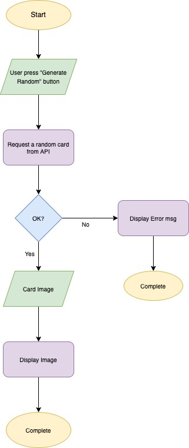

# Sakura Magic Card Collection

This project is built with love for my childhood favourite anime Cardcaptor Sakura, using this fantastic api https://github.com/JessVel/sakura-card-captor-api.

## Tech used

- HTML
- CSS
- Javascript
- DOM

## Features

1. Find your lucky Sakura Card today by pressing the "Get a Random Card" button.
2. View all Sakura Cards by pressing the "Show All Sakura Card" button.
3. Not in the mood for the current background? Change the background by pressing the "Change Background" button.
4. Skeuomorphic button styling for better user interaction
5. Mobile-friendly design for mobile/small screen users.

## Planning

Flowchart working with API:  

